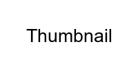

# placeholder-api

[](https://heroku.com/deploy)

High performance image placeholder generator API with caching support

```
GET /placeholder?options
```

Features:
- .NET Core built-in response compression (gzip)
- .NET Core built-in response caching
- [`EasyCaching`](https://github.com/dotnetcore/EasyCaching) library for caching the generated thumbnail for 5 minutes

Options:
- height: `Integer` => `100` (default)
- width: `Integer` => `100` (default)
- color: `KnownColor` (enum) => `LightGrey` (default)
- text: `String` => `""` (default)
- format: `KnownImageFormat` (enum) => `Png` (default)

Enums:
- [`KnownColor`](https://docs.microsoft.com/en-us/dotnet/api/system.drawing.knowncolor?view=net-5.0#fields) source
- [`KnownImageFormat`](https://docs.microsoft.com/en-us/dotnet/api/system.drawing.imaging.imageformat?view=dotnet-plat-ext-5.0#properties) source

Example:
```
http://localhost:5000/Placeholder?height=100&width=200&text=Thumbnail&format=Png&color=Grey
```


